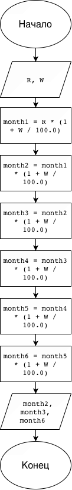

# Домашнее задание к работе 2

## Условие задачи
Клиент внес в банк **R** рублей. Каждый месяц эта сумма увеличивается на **W** процентов. Сколько будет у клиента денег через два месяца, три месяца, через полгода?

## 1. Алгоритм и блок-схема

### Алгоритм
1. **Начало**
2. Задать исходные данные (ввод с клавиатуры):
   - `R` — начальная сумма вклада в рублях.
   - `W` — процент увеличения суммы за один месяц.
3. Вычислить баланс за каждый месяц с учетом сложного процента:
   - `month1` = `R` * (1 + `W` / 100)
   - `month2` = `month1` * (1 + `W` / 100)
   - `month3` = `month2` * (1 + `W` / 100)
   - `month4` = `month3` * (1 + `W` / 100)
   - `month5` = `month4` * (1 + `W` / 100)
   - `month6` = `month5` * (1 + `W` / 100)
4. Вывести рассчитанные значения баланса через 2 месяца (`month2`), 3 месяца (`month3`) и полгода (`month6`).
5. **Конец**

### Блок-схема
 

## 2. Реализация программы

```c
#include <stdio.h>

int main() {
    double R;
    double W;

    printf("Введите начальную сумму (R): ");
    scanf("%lf", &R);

    printf("Введите процент за месяц (W): ");
    scanf("%lf", &W);

    double month1 = R * (1 + W / 100.0);
    double month2 = month1 * (1 + W / 100.0);
    double month3 = month2 * (1 + W / 100.0);
    double month4 = month3 * (1 + W / 100.0);
    double month5 = month4 * (1 + W / 100.0);
    double month6 = month5 * (1 + W / 100.0);

    printf("\n");
    printf("Через 2 месяца: %.2lf руб.\n", month2);
    printf("Через 3 месяца: %.2lf руб.\n", month3);
    printf("Через полгода (6 месяцев): %.2lf руб.\n", month6);

    return 0;
}
```

## 3. Результаты работы программы

```text
Введите начальную сумму (R): 10000
Введите процент за месяц (W): 5

Через 2 месяца: 11025.00 руб.
Через 3 месяца: 11576.25 руб.
Через полгода (6 месяцев): 13400.96 руб.
```

## 4. Информация о разработчике

Цимбалист Костя бИЦТ-261
